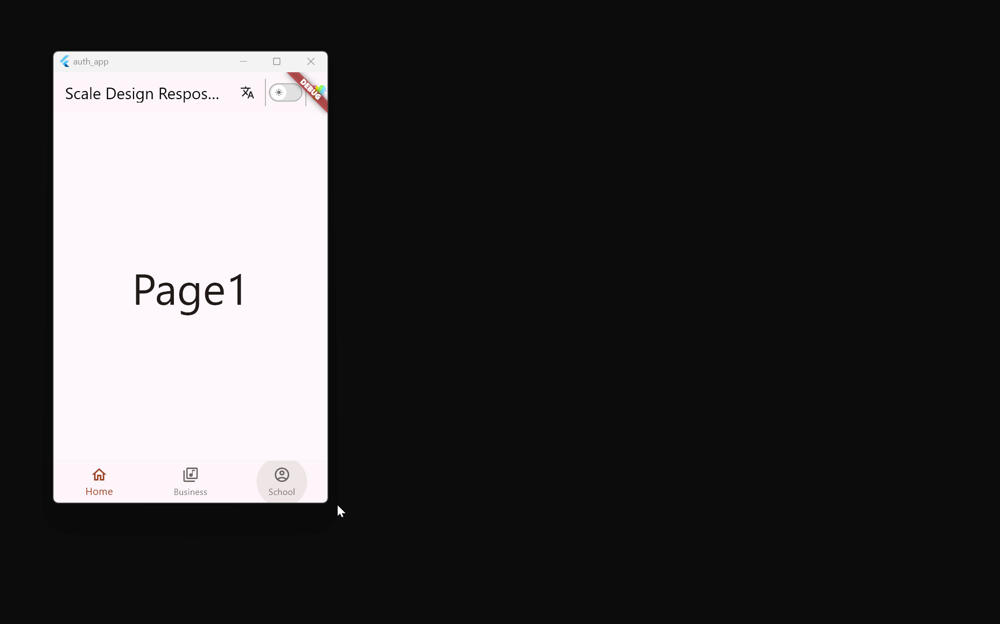
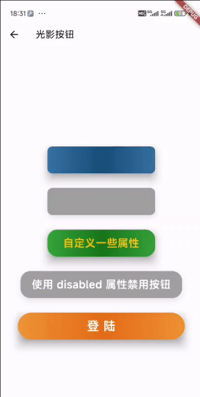

# Scale Design

[中文文档](./README_CN.md)

The **Scale Design** library provides utilities for managing screen dimensions and creating responsive layouts in Flutter applications, allowing you to achieve screen size proportion scaling. It includes functions for scaling dimensions proportionally and obtaining screen width and height ratios. This is particularly useful when designing for different device screen sizes and orientations.

# 1. Installation

To use this package, you can run the following command:

```yaml
flutter pub add scale_design
```

This will automatically install the latest version in your project.

# 2. Usage

## 1. Usage of the size Toolset

### Initialize the `Scale` Class

Before using the scaling functions, you need to initialize the `Scale` class with the desired standard screen width and height values. This initialization should typically be done in your app's main file or an early part of your application.

```dart
import 'package:flutter/material.dart';
import 'package:flutter_scale/flutter_scale.dart';

void main() {
  runApp(MyApp());
}

class MyApp extends StatelessWidget {
  @override
  Widget build(BuildContext context) {
    // Initialize the Scale class with your preferred standard screen dimensions.
    Scale().init(context, standardWidth, standardHeight);

    return MaterialApp(
      // Your app configuration here...
    );
  }
}
```

### Scaling Functions

Once the `Scale` class is initialized, you can use the provided scaling functions to adapt your layout based on the screen size. For example, to scale a height value:

```dart
double scaledHeight = scaleHeight(50); // Scales the height based on the screen size
```

Similarly, you can scale width, get proportions of the screen width or height, and customize your layout to be responsive to different devices.

```dart
double scaledWidth = scaleWidth(100); // Scales the width based on the screen size
double oneThirdScreenWidth = perWidth(3); // Gets one-third of the screen width
double oneFifthScreenHeight = perHeight(5); // Gets one-fifth of the screen height
```

### Example

Here's an example of using the `flutter_scale` package to create a responsive layout:

```dart
import 'package:flutter/material.dart';
import 'package:flutter_scale/flutter_scale.dart';

void main() {
  runApp(MyApp());
}

class MyApp extends StatelessWidget {
  @override
  Widget build(BuildContext context) {
    // Initialize the Scale class with your preferred standard screen dimensions.
    Scale().init(context, 375.0, 812.0);

    return MaterialApp(
      home: Scaffold(
        appBar: AppBar(
          title: Text('Responsive Layout Example'),
        ),
        body: Center(
          child: Container(
            width: scaleWidth(200), // Scaled width
            height: scaleHeight(100), // Scaled height
            color: Colors.blue,
            child: Center(
              child: Text(
                'Responsive Text',
                style: TextStyle(
                  fontSize: scaleWidth(16), // Scaled font size
                ),
              ),
            ),
          ),
        ),
      ),
    );
  }
}
```

In this example, the layout dimensions and font size are scaled proportionally to fit the current screen size, creating a responsive design.

### Components

#### ElevatedBtn

ElevatedBtn inherits from Flutter's ElevatedButton class. Unlike ElevatedButton, ElevatedBtn adds width, height, and disabled parameters and uses the scaleHeight and scaleWidth functions to handle size issues in the constructor.

- The width and height parameters control the size of the button. They are processed by the scaleWidth and scaleHeight functions to scale the button size based on screen width and height.
- The disabled parameter controls whether the button is disabled. When disabled is true, the onPressed callback of the button is set to null, making the button disabled.

Additionally, ElevatedBtn accepts all the parameters of ElevatedButton, and you can use them as needed. For example, you can set the button's color, shape, tooltip text, and more.

```dart
ElevatedBtn(
  'Click Me', // Text on the button
  width: 100.0, // Width of the button
  height: 50.0, // Height of the button
  onPressed: () {
    // Code to execute when the button is clicked
    print('Button clicked!');
  },
  backgroundColor: Colors.blue, // Background color of the button
  foregroundColor: Colors.white, // Foreground color (text and icon color) of the button
  elevation: 5.0, // Button elevation
  shape: RoundedRectangleBorder( // Button shape
    borderRadius: BorderRadius.circular(10.0), // Border radius
  ),
);
```

#### OutlinedBtn

OutlinedBtn inherits from Flutter's OutlinedButton class. Unlike OutlinedButton, OutlinedBtn adds width, height, and disabled parameters and uses the scaleHeight and scaleWidth functions to handle size issues in the constructor.

- The width and height parameters control the size of the button. They are processed by the scaleWidth and scaleHeight functions to scale the button size based on screen width and height.
- The disabled parameter controls whether the button is disabled. When disabled is true, the onPressed callback of the button is set to null, making the button disabled.

Additionally, OutlinedBtn accepts all the parameters of OutlinedButton, and you can use them as needed. For example, you can set the button's style, text, and more.

```dart
OutlinedBtn(
  'Click Me', // Text on the button
  width: 100.0, // Width of the button
  height: 50.0, // Height of the button
  onPressed: () {
    // Code to execute when the button is clicked
    print('Button clicked!');
  },
  style: OutlinedButton.styleFrom( // Button style
    side: BorderSide(color: Colors.blue, width: 2), // Border color and width
  ),
);
```

#### FloatingActionBtn

FloatingActionBtn is a custom floating action button class that inherits from Flutter's FloatingActionButton class. Unlike FloatingActionButton, FloatingActionBtn adds size and disabled parameters and uses the scaleHeight and scaleWidth functions to handle size issues in the constructor.

- The size parameter controls the size of the button. It is processed by the scaleWidth function to scale the button size based on screen width.
- The disabled parameter controls whether the button is disabled. When disabled is true, the onPressed callback of the button is set to null, making the button disabled.

Additionally, FloatingActionBtn accepts all the parameters of FloatingActionButton, and you can use them as needed. For example, you can set the button's color, shape, tooltip text, and more.

##### Explanation of _DefaultHeroTag Class

_DefaultHeroTag is an internal class used to provide a default hero tag for FloatingActionButton. Hero tags are used in Flutter's Hero animations to identify widgets' starting and ending positions in the animation.

For example:

```dart
FloatingActionBtn(
  size: 56.0, // Button size
  disabled: false, // Whether the button is disabled
  child: Icon(Icons.add), // Icon on the button
  tooltip: 'Add', // Button tooltip text
  onPressed: () {
    // Code to execute when the button is clicked
    print 'Button clicked!';
  },
  backgroundColor: Colors.blue, // Button background color
  foregroundColor: Colors.white, // Button foreground color (icon color)
  elevation: 5.0, // Button elevation
  shape: RoundedRectangleBorder( // Button shape
    borderRadius: BorderRadius.circular(10.0), // Border radius
  ),
);
```

Here, we've created a FloatingActionBtn with a size of 56.0. When the button is clicked, it prints 'Button clicked!'. The button's background color is blue, foreground color (icon color) is white, elevation is 5.0, shape is a rounded rectangle with a border radius of 10.0.

#### T

T is a custom text class that inherits from Flutter's Text class. Unlike Text, T uses the scaleFont function in the constructor to handle font size and line height issues in the style.

Additionally, T accepts all the parameters of Text, and you can use them as needed. For example, you can set text color, background color, font size, font weight, font style, letter spacing, word spacing, text baseline, line height, foreground, background, shadow, font features, font variations, decoration, decoration color, decoration style, decoration thickness, debug label, font family, font family fallback, and more.

T has two constructors: T and T.rich. The T constructor is used to create a T instance containing simple text, while the T.rich constructor is used to create a T instance containing rich text (multiple text fragments with different styles).

Here are examples of how to use the T class:

1. Using the T default constructor

```dart
T(
  'Hello, world!', // Text content
  color: Colors.red, // Text color
  fontSize: 20.0, // Font size
  fontWeight: FontWeight.bold, // Font weight
);
```

2. Using the T.rich constructor

```dart
T.rich(
  TSpan(
    text: 'Hello, ',
    children: <TSpan>[
      TSpan(
        text: 'world',
        style: TextStyle(color: Colors.red),
      ),
      TSpan(
        text: '!',
      ),
    ],
  ), // Rich text content
  fontSize: 20.0, // Font size
  fontWeight: FontWeight.bold, // Font weight
);
```

#### TextBtn

TextBtn inherits from Flutter's TextButton class. Unlike TextButton, TextBtn adds width, height, and disabled parameters and uses the scaleHeight and scaleWidth functions to handle size issues in the constructor.

- The width and height parameters control the size of the button. They are processed by the scaleWidth and scaleHeight functions to scale the button size based on screen width and height.
- The disabled parameter controls whether the button is disabled. When disabled is true, the onPressed callback of the button is set to null, making the button disabled.

Additionally, TextBtn accepts all the parameters of TextButton, and you can use them as needed. For example, you can set the button's style, text, and more.

```dart
TextBtn(
  'Click Me', // Text on the button
  width: 100.0, // Width of the button
  height: 50.0, // Height of the button
  onPressed: () {
    // Code to execute when the button is clicked
    print('Button clicked!');
  },
  style: TextButton.styleFrom( // Button style
    primary: Colors.blue, // Text color
  ),
);
```

#### TSpan

TSpan inherits from Flutter's TextSpan class. Unlike TextSpan, TSpan uses the scaleFont function in the constructor to handle font size and line height issues in the style.

```dart
TSpan(
  text: 'Hello, ',
  children: <InlineSpan>[
    TSpan(
      text: 'world',
      style: TextStyle(color: Colors.red),
    ),
    TSpan(
      text: '!',
    ),
  ],
  fontSize: 20.0, // Font size
  fontWeight: FontWeight.bold, // Font weight
);
```
## 2. Usage of the Responsive Toolset

The design philosophy behind the Responsive toolset is entirely different from the Size toolset.

The former (Size toolset) is aimed at designing pages based on fixed UI design drafts. In such cases, regardless of the device on which the designer is working, the expected outcome is a more consistent effect across different devices. Applications designed in this manner tend to exhibit a stretched proportion effect when displayed on devices with significantly different sizes, which is actually favorable for pure mobile applications.

Flutter is a powerful cross-platform development framework. Suppose you're developing an application that needs to be compatible with multiple platforms (including smartphones, PCs, and tablets) and you truly desire "write once, run on multiple platforms" functionality. In that case, you need the Responsive toolset.

### Responsive Component

The Responsive component is a tool for implementing responsive layouts in Flutter applications. It allows developers to display different layouts based on the screen width of the user's device, supporting mobile devices, tablets, and desktops. By providing different widgets for the mobile, tablet, and desktop parameters, you can customize layouts for different screen sizes.

#### Usage

1. Define layouts: First, define layouts for different types of devices. This means you need to prepare three widgets, each corresponding to mobile devices, tablets, and desktops.
2. Use the Responsive component: In your interface, use the Responsive component and pass in the previously defined layout widgets.

#### Example

Suppose you have three layout components: MobileLayout, TabletLayout, and DesktopLayout. You can use the Responsive component as follows:

```dart
import 'package:flutter/material.dart';
import 'package:scale_design/scale_design.dart';

class MyHomePage extends StatelessWidget {
  @override
  Widget build(BuildContext context) {
    return Scaffold(
      body: Responsive(
        mobile: MobileLayout(), // Mobile device layout
        tablet: TabletLayout(), // Tablet device layout
        desktop: DesktopLayout(), // Desktop device layout
      ),
    );
  }
}
```

In most cases, we have layouts for mobile devices and desktop devices. Tablet device layouts often fall somewhere between the two and can be substituted for either, so you don't necessarily have to explicitly specify a value for the `tablet` option; it will automatically use the same value as the `desktop` option.

### ResponsiveScaffold Component

**So, how can you quickly build a responsive application? The ResponsiveScaffold** component is a framework for rapidly constructing responsive navigation. It is a ready-made solution based on dual navigation bars.

```dart
import 'package:flutter/material.dart';
import 'package:app_service/app_service.dart';
import 'package:scale_design/scale_design.dart';
import '../../widgets/hr_v.dart';

class IndexView extends StatelessWidget {
  static const String url = '/index';
  // 定义底部导航项
  final List<BottomNavigationBarItem> _navBarItems = const [
    BottomNavigationBarItem(
      icon: Icon(Icons.home_outlined),
      label: 'Home',
    ),
    BottomNavigationBarItem(
      icon: Icon(Icons.library_music_outlined),
      label: 'Business',
    ),
    BottomNavigationBarItem(
      icon: Icon(Icons.account_circle_outlined),
      label: 'School',
    ),
  ];

  // 定义对应的页面
  final List<Widget> _pages = const [
    Page1(),
    Page2(),
    Page3(),
  ];

  const IndexView({super.key});

  @override
  Widget build(BuildContext context) {
    return ResposiveScaffold(
      pages: _pages,
      items: _navBarItems,
      appBar: AppBar(
        title: const Text('Scale Design ResposiveScaffold Demo'),
        actions: const [
          Wen(),
          HrV(),
          DarkModeSwitch(),
          HrV(),
          ThemeModal(),
        ],
      ),
    );
  }
}

class Page1 extends StatelessWidget {
  const Page1({super.key});

  @override
  Widget build(BuildContext context) {
    return const Center(
      child: Text(
        'Page1',
        style: TextStyle(fontSize: 60),
      ),
    );
  }
}

class Page2 extends StatelessWidget {
  const Page2({super.key});

  @override
  Widget build(BuildContext context) {
    return const Center(
      child: Text(
        'Page2',
        style: TextStyle(fontSize: 60),
      ),
    );
  }
}

class Page3 extends StatelessWidget {
  const Page3({super.key});

  @override
  Widget build(BuildContext context) {
    return const Center(
      child: Text(
        'Page3',
        style: TextStyle(fontSize: 60),
      ),
    );
  }
}

```



## 3.其它组件

### SlideText

A text widget that scrolls in a vertical loop.

For example:

```dart
SlideText(
  [
    '你有未读消息，请尽快处理1',
    '你有未读消息，请尽快处理2',
    '你有未读消息，请尽快处理3',
    '你有未读消息，请尽快处理4',
  ],
  // The isScrollUp parameter defaults to true, indicating upward scrolling
  isScrollUp: true, 
)
```

The effect is as follows:


You can set the text size through the fontSize parameter. This size is already based on the scaleFont size, so you don't need to manually call fontSize. If you need to control the height, you can specify the height parameter, which also does not require manual calling of the scaleHeight parameter.

### ScrollableIconsCard

A component for displaying a set of horizontally scrollable icon cards. For example:

```dart
// 定义一组图标与触碰图标时的回调，假设下main这些图标在你的项目中存在
List<Map<String, Object>> datas = [
  {'img': 'assets/svgs/捡漏.svg', 'title': '捡漏', 'onTap': () => print('捡漏')},
  {'img': 'assets/svgs/摇现金.svg', 'title': '摇现金', 'onTap': () => print('捡漏')},
  {'img': 'assets/svgs/聚补贴.svg', 'title': '聚补贴', 'onTap': () => print('捡漏')},
  {'img': 'assets/svgs/领券中心.svg', 'title': '领券中心', 'onTap': () => print('捡漏')},
  {'img': 'assets/svgs/肥鱼.svg', 'title': '肥鱼', 'onTap': () => print('捡漏')},
  {'img': 'assets/svgs/金币.svg', 'title': '金币', 'onTap': () => print('捡漏')},
  {'img': 'assets/svgs/工厂购.svg', 'title': '工厂购', 'onTap': () => print('捡漏')},
  {'img': 'assets/svgs/小时达.svg', 'title': '小时达', 'onTap': () => print('捡漏')},
  {'img': 'assets/svgs/全球购.svg', 'title': '全球购', 'onTap': () => print('捡漏')},
  {'img': 'assets/svgs/全部频道.svg', 'title': '全部频道', 'onTap': () => print('捡漏')},
  {'img': 'assets/svgs/活动日历.svg', 'title': '活动日历', 'onTap': () => print('捡漏')},
  {'img': 'assets/svgs/减肥助手.svg', 'title': '减肥助手', 'onTap': () => print('捡漏')},
  {'img': 'assets/svgs/购1001铺.svg','title': '购1001铺','onTap': () => print('捡漏')},
  {'img': 'assets/svgs/小美庭院.svg', 'title': '小美庭院', 'onTap': () => print('捡漏')},
  {'img': 'assets/svgs/动物餐厅.svg', 'title': '动物餐厅', 'onTap': () => print('捡漏')},
  {'img': 'assets/svgs/购票票.svg', 'title': '购票票', 'onTap': () => print('捡漏')},
  {'img': 'assets/svgs/地狗好屋.svg', 'title': '地狗好屋', 'onTap': () => print('捡漏')},
  {'img': 'assets/svgs/飞鸟旅行.svg', 'title': '飞鸟旅行', 'onTap': () => print('捡漏')},
  {'img': 'assets/svgs/资质规则.svg', 'title': '资质规则', 'onTap': () => print('捡漏')},
  {'img': 'assets/svgs/分类.svg', 'title': '分类', 'onTap': () => print('捡漏')},
];


ScrollableIconsCard(
  datas: datas,
),
```

The effect is as follows:


The default values of the various parameters of the ScrollableIconsCard component are as follows:

| Parameter Name | Type   | Default Value                      | Description                        |
| :------------- | :----- | :--------------------------------- | :--------------------------------- |
| amount         | int    | 3                                  | The number of units in each column |
| spoutWidth     | double | 80                                 | The width of the spout             |
| sliderWidth    | double | 40                                 | The width of the slider            |
| sliderHeight   | double | 7                                  | The height of the spout and slider |
| spoutColor     | Color  | Color.fromARGB(255, 183, 183, 183) | The color of the spout             |
| sliderColor    | Color  | Color.fromARGB(255, 255, 134, 13)  | The color of the slider            |

Where width is based on scaleWidth, height is based on scaleHeight.

## Tips

You can find more examples in the [scale design example](https://github.com/jacklee1995/flutter_scale_design/tree/master/example), such as:

|                                           |                                           |
| ----------------------------------------- | ----------------------------------------- |
|  |  |

### `ShinyButton` Widget

The light and shadow button has its own light and shadow effect, and the light and shadow animation of the button can be realized by specifying a set of color values, such as:

```dart
class ShinyButtonExample extends StatelessWidget {
  const ShinyButtonExample({super.key});

  @override
  Widget build(BuildContext context) {
    return Scaffold(
      appBar: AppBar(
        title: T(
          '光影按钮',
          fontSize: 18,
        ),
      ),
      body: Center(
        child: Column(
          mainAxisAlignment: MainAxisAlignment.center,
          children: <Widget>[
            // 当仅传递 onPressed 的时候
            ShinyButton(onPressed: () {}),

            const SizedBox(height: 30),

            // 如果没有任何参数则成为禁用状态
            ShinyButton(),

            const SizedBox(height: 30),

            // 你也可以自定义圆角、颜色、子元素等参数
            ShinyButton(
              borderRadius: 20,
              colors: const [
                Color.fromARGB(255, 112, 255, 117),
                Color.fromARGB(255, 0, 81, 3),
                Color.fromARGB(255, 112, 255, 117),
              ],
              child: T(
                '自定义一些属性',
                color: Colors.amber,
                fontSize: 20,
                fontWeight: FontWeight.bold,
              ),
              onPressed: () {
                print('Button Pressed');
              },
            ),

            const SizedBox(height: 30),

            // 使用 disabled 属性禁用按钮
            ShinyButton(
              borderRadius: 20,
              width: 300,
              colors: const [
                Color.fromARGB(255, 112, 255, 117),
                Color.fromARGB(255, 0, 81, 3),
                Color.fromARGB(255, 112, 255, 117),
              ],
              disabled: true,
              onPressed: () {},
              child: T(
                '使用 disabled 属性禁用按钮',
                color: Colors.white,
                fontSize: 20,
                fontWeight: FontWeight.bold,
              ),
            ),

            const SizedBox(height: 30),

            // 一个登陆按钮的示例
            ShinyButton(
              borderRadius: 60,
              width: 310,
              colors: const [
                Color.fromARGB(255, 255, 224, 112),
                Color.fromARGB(255, 220, 77, 0),
                Color.fromARGB(255, 255, 224, 112),
              ],
              onPressed: () {},
              child: T(
                '登 陆',
                color: Colors.white,
                fontSize: 23,
                fontWeight: FontWeight.bold,
              ),
            ),
          ],
        ),
      ),
    );
  }
}
```

The effect is as follows (the jumping effect is generated after clicking):



## License

This package is open-source and available under the [MIT License](LICENSE).

Feel free to use it in your Flutter projects, and contributions or issues are welcome on the [GitHub repository](https://github.com/jacklee1995/flutter_scale_design).
