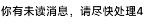

# Scale Design

[English Document](./README.md)

**Scale Design** 库提供了用于 Flutter 管理屏幕尺寸和创建响应式布局的实用工具，可以通过此包实现应用程序的屏幕尺寸比例缩放。它包括用于按比例缩放尺寸并获取屏幕宽度和高度比例的函数。这在需要适应不同设备屏幕尺寸和方向的设计中特别有用。

## 安装

要使用此包，可以运行 app 命令：

```yaml
flutter pub add scale_design
```

这将在你的项目中自动安装最先的版本。

## 使用

### 初始化 `Scale` 类

在使用缩放函数之前，需要使用所需的标准屏幕宽度和高度值初始化 `Scale` 类。此初始化通常应在应用程序的主文件或应用程序的早期部分完成。

```dart
import 'package:flutter/material.dart';
import 'package:flutter_scale/flutter_scale.dart';

void main() {
  runApp(MyApp());
}

class MyApp extends StatelessWidget {
  @override
  Widget build(BuildContext context) {
    // 使用你的首选标准屏幕尺寸初始化 Scale 类。
    Scale().init(context, standardWidth, standardHeight);

    return MaterialApp(
      // 在此配置你的应用程序...
    );
  }
}
```

### 缩放函数

一旦初始化了 `Scale` 类，就可以使用提供的缩放函数根据屏幕大小调整布局。例如，要缩放高度值：

```dart
double scaledHeight = scaleHeight(50); // 根据屏幕大小缩放高度
```

类似地，你可以按比例缩放宽度、获取屏幕宽度或高度的比例，并自定义布局以响应不同的设备。

```dart
double scaledWidth = scaleWidth(100); // 根据屏幕大小缩放宽度
double oneThirdScreenWidth = perWidth(3); // 获取屏幕宽度的三分之一
double oneFifthScreenHeight = perHeight(5); // 获取屏幕高度的五分之一
```

## 示例

以下是使用 `flutter_scale` 包创建响应式布局的示例：

```dart
import 'package:flutter/material.dart';
import 'package:flutter_scale/flutter_scale.dart';

void main() {
  runApp(MyApp());
}

class MyApp extends StatelessWidget {
  @override
  Widget build(BuildContext context) {
    // 使用你的首选标准屏幕尺寸初始化 Scale 类。
    Scale().init(context, 375.0, 812.0);

    return MaterialApp(
      home: Scaffold(
        appBar: AppBar(
          title: Text('响应式布局示例'),
        ),
        body: Center(
          child: Container(
            width: scaleWidth(200), // 缩放后的宽度
            height: scaleHeight(100), // 缩放后的高度
            color: Colors.blue,
            child: Center(
              child: Text(
                '响应式文本',
                style: TextStyle(
                  fontSize: scaleWidth(16), // 缩放后的字体大小
                ),
              ),
            ),
          ),
        ),
      ),
    );
  }
}
```

在此示例中，布局尺寸和字体大小按比例缩放以适应当前屏幕大小，从而创建了响应式设计。


## 组件

### ElevatedBtn

ElevatedBtn 继承自 Flutter 的 ElevatedButton 类。与 ElevatedButton 不同的是，ElevatedBtn 添加了 width、height 和 disabled 参数，并在构造函数中使用 scaleHeight 和 scaleWidth 函数处理样式中的尺寸问题。

- width 和 height 参数用于控制按钮的大小。它们会被 scaleWidth 和 scaleHeight 函数处理，以根据屏幕宽度和高度缩放按钮的大小。
- disabled 参数用于控制按钮是否禁用。当 disabled 为 true 时，按钮的 onPressed 回调会被设置为 null，使得按钮处于禁用状态。

此外，ElevatedBtn 还接受 ElevatedButton 的所有参数，你可以根据需要使用它们。例如，你可以设置按钮的颜色、形状、提示文本等等。


```
ElevatedBtn(
  'Click Me', // 按钮上的文本
  width: 100.0, // 按钮的宽度
  height: 50.0, // 按钮的高度
  onPressed: () {
    // 当按钮被点击时，执行这里的代码
    print('Button clicked!');
  },
  backgroundColor: Colors.blue, // 按钮的背景颜色
  foregroundColor: Colors.white, // 按钮的前景颜色（即文本和图标的颜色）
  elevation: 5.0, // 按钮的阴影高度
  shape: RoundedRectangleBorder( // 按钮的形状
    borderRadius: BorderRadius.circular(10.0), // 圆角半径
  ),
);
```


### OutlinedBtn

OutlinedBtn 继承自 Flutter 的 OutlinedButton 类。与 OutlinedButton 不同的是，OutlinedBtn 添加了 width、height 和 disabled 参数，并在构造函数中使用 scaleHeight 和 scaleWidth 函数处理样式中的尺寸问题。

- width 和 height 参数用于控制按钮的大小。它们会被 scaleWidth 和 scaleHeight 函数处理，以根据屏幕宽度和高度缩放按钮的大小。
- disabled 参数用于控制按钮是否禁用。当 disabled 为 true 时，按钮的 onPressed 回调会被设置为 null，使得按钮处于禁用状态。

此外，OutlinedBtn 还接受 OutlinedButton 的所有参数，你可以根据需要使用它们。例如，你可以设置按钮的样式、文本等等。

```dart
OutlinedBtn(
  'Click Me', // 按钮上的文本
  width: 100.0, // 按钮的宽度
  height: 50.0, // 按钮的高度
  onPressed: () {
    // 当按钮被点击时，执行这里的代码
    print('Button clicked!');
  },
  style: OutlinedButton.styleFrom( // 按钮的样式
    side: BorderSide(color: Colors.blue, width: 2), // 边框的颜色和宽度
  ),
);
```


### FloatingActionBtn

FloatingActionBtn 是一个自定义的浮动动作按钮类，它继承自 Flutter 的 FloatingActionButton 类。与 FloatingActionButton 不同的是，FloatingActionBtn 添加了 size 和 disabled 参数，并在构造函数中使用 scaleHeight 和 scaleWidth 函数处理样式中的尺寸问题。

- size 参数用于控制按钮的大小。它会被 scaleWidth 函数处理，以根据屏幕宽度缩放按钮的大小。
- disabled 参数用于控制按钮是否禁用。当 disabled 为 true 时，按钮的 onPressed 回调会被设置为 null，使得按钮处于禁用状态。

此外，FloatingActionBtn 还接受 FloatingActionButton 的所有参数，你可以根据需要使用它们。例如，你可以设置按钮的颜色、形状、提示文本等等。

#### _DefaultHeroTag 类说明

_DefaultHeroTag 是一个内部类，它用于为 FloatingActionButton 提供默认的 hero tag。Hero tag 在 Flutter 的 Hero 动画中使用，用于标识动画的开始和结束位置的 widget。

例如：

```dart
FloatingActionBtn(
  size: 56.0, // 按钮的大小
  disabled: false, // 按钮是否禁用
  child: Icon(Icons.add), // 按钮上的图标
  tooltip: 'Add', // 按钮的提示文本
  onPressed: () {
    // 当按钮被点击时，执行这里的代码
    print('Button clicked!');
  },
  backgroundColor: Colors.blue, // 按钮的背景颜色
  foregroundColor: Colors.white, // 按钮的前景颜色（即图标的颜色）
  elevation: 5.0, // 按钮的阴影高度
  shape: RoundedRectangleBorder( // 按钮的形状
    borderRadius: BorderRadius.circular(10.0), // 圆角半径
  ),
);
```


这里我们创建了一个大小为 56.0 的 FloatingActionBtn。当按钮被点击时，它会打印 'Button clicked!'。按钮的背景颜色是蓝色，前景颜色（即图标的颜色）是白色。按钮的阴影高度是 5.0，形状是圆角矩形，圆角半径是 10.0。


### T

T 它继承自 Flutter 的 Text 类。与 Text 不同的是，T 在构造函数中使用 scaleFont 函数处理样式中的字体大小和行高问题。

此外，T 还接受 Text 的所有参数，你可以根据需要使用它们。例如，你可以设置文本的颜色、背景颜色、字体大小、字体权重、字体样式、字母间距、单词间距、文本基线、行高、前景、背景、阴影、字体特性、字体变化、装饰、装饰颜色、装饰样式、装饰厚度、调试标签、字体家族、字体家族回退、包等等。

T 类有两个构造函数：T 和 T.rich。T 构造函数用于创建包含简单文本的 T 实例，而 T.rich 构造函数用于创建包含富文本（即包含多个具有不同样式的文本片段）的 T 实例。

以下是如何使用 T 类的示例：

1. 使用 T 默认构造函数

```dart
T(
  'Hello, world!', // 文本内容
  color: Colors.red, // 文本颜色
  fontSize: 20.0, // 字体大小
  fontWeight: FontWeight.bold, // 字体粗细
);
```


2. 使用 T.rich 构造函数

```dart
T.rich(
  TSpan(
    text: 'Hello, ',
    children: <TSpan>[
      TSpan(
        text: 'world',
        style: TextStyle(color: Colors.red),
      ),
      TSpan(
        text: '!',
      ),
    ],
  ), // 富文本内容
  fontSize: 20.0, // 字体大小
  fontWeight: FontWeight.bold, // 字体权重
);
```


### TextBtn

TextBtn 继承自 Flutter 的 TextButton 类。与 TextButton 不同的是，TextBtn 添加了 width、height 和 disabled 参数，并在构造函数中使用 scaleHeight 和 scaleWidth 函数处理样式中的尺寸问题。

- width 和 height 参数用于控制按钮的大小。它们会被 scaleWidth 和 scaleHeight 函数处理，以根据屏幕宽度和高度缩放按钮的大小。
- disabled 参数用于控制按钮是否禁用。当 disabled 为 true 时，按钮的 onPressed 回调会被设置为 null，使得按钮处于禁用状态。

此外，TextBtn 还接受 TextButton 的所有参数，你可以根据需要使用它们。例如，你可以设置按钮的样式、文本等等。


```dart
TextBtn(
  'Click Me', // 按钮上的文本
  width: 100.0, // 按钮的宽度
  height: 50.0, // 按钮的高度
  onPressed: () {
    // 当按钮被点击时，执行这里的代码
    print('Button clicked!');
  },
  style: TextButton.styleFrom( // 按钮的样式
    primary: Colors.blue, // 文本的颜色
  ),
);
```


### TSpan

TSpan 继承自 Flutter 的 TextSpan 类。与 TextSpan 不同的是，TSpan 在构造函数中使用 scaleFont 函数处理样式中的字体大小和行高问题。


```dart
TSpan(
  text: 'Hello, ',
  children: <InlineSpan>[
    TSpan(
      text: 'world',
      style: TextStyle(color: Colors.red),
    ),
    TSpan(
      text: '!',
    ),
  ],
  fontSize: 20.0, // 字体大小
  fontWeight: FontWeight.bold, // 字体权重
);
```

### SlideText

一个垂直方向循环滑动切换的文本组件。

例如：

```dart
SlideText(
  [
    '你有未读消息，请尽快处理1',
    '你有未读消息，请尽快处理2',
    '你有未读消息，请尽快处理3',
    '你有未读消息，请尽快处理4',
  ],
  isScrollUp: true, // isScrollUp 参数默认为 true 表示向上滚动
)
```

效果如下：



你可以通过 fontSize 参数设置文本大小。这个大小已经是基于 scaleFont 的尺寸了，因此你不需要手动调用 fontSize。如果需要控制高度，你可以指定 height 参数，它同样不需要手动调用 scaleHeight 参数。

### ScrollableIconsCard

用于显示一组横向滚动的图标卡片的组件。例如：

```dart
// 定义一组图标与触碰图标时的回调，假设下main这些图标在你的项目中存在
List<Map<String, Object>> datas = [
  {'img': 'assets/svgs/捡漏.svg', 'title': '捡漏', 'onTap': () => print('捡漏')},
  {'img': 'assets/svgs/摇现金.svg', 'title': '摇现金', 'onTap': () => print('捡漏')},
  {'img': 'assets/svgs/聚补贴.svg', 'title': '聚补贴', 'onTap': () => print('捡漏')},
  {'img': 'assets/svgs/领券中心.svg', 'title': '领券中心', 'onTap': () => print('捡漏')},
  {'img': 'assets/svgs/肥鱼.svg', 'title': '肥鱼', 'onTap': () => print('捡漏')},
  {'img': 'assets/svgs/金币.svg', 'title': '金币', 'onTap': () => print('捡漏')},
  {'img': 'assets/svgs/工厂购.svg', 'title': '工厂购', 'onTap': () => print('捡漏')},
  {'img': 'assets/svgs/小时达.svg', 'title': '小时达', 'onTap': () => print('捡漏')},
  {'img': 'assets/svgs/全球购.svg', 'title': '全球购', 'onTap': () => print('捡漏')},
  {'img': 'assets/svgs/全部频道.svg', 'title': '全部频道', 'onTap': () => print('捡漏')},
  {'img': 'assets/svgs/活动日历.svg', 'title': '活动日历', 'onTap': () => print('捡漏')},
  {'img': 'assets/svgs/减肥助手.svg', 'title': '减肥助手', 'onTap': () => print('捡漏')},
  {'img': 'assets/svgs/购1001铺.svg','title': '购1001铺','onTap': () => print('捡漏')},
  {'img': 'assets/svgs/小美庭院.svg', 'title': '小美庭院', 'onTap': () => print('捡漏')},
  {'img': 'assets/svgs/动物餐厅.svg', 'title': '动物餐厅', 'onTap': () => print('捡漏')},
  {'img': 'assets/svgs/购票票.svg', 'title': '购票票', 'onTap': () => print('捡漏')},
  {'img': 'assets/svgs/地狗好屋.svg', 'title': '地狗好屋', 'onTap': () => print('捡漏')},
  {'img': 'assets/svgs/飞鸟旅行.svg', 'title': '飞鸟旅行', 'onTap': () => print('捡漏')},
  {'img': 'assets/svgs/资质规则.svg', 'title': '资质规则', 'onTap': () => print('捡漏')},
  {'img': 'assets/svgs/分类.svg', 'title': '分类', 'onTap': () => print('捡漏')},
];


ScrollableIconsCard(
  datas: datas,
),
```

效果如下：


ScrollableIconsCard 组件的各个参数默认值如下：

| 参数名 | 类型 | 默认值 | 描述 |
|:-|:-|:-|:-|
| amount | int | 3 | 每一列的单元数量
| spoutWidth | double | 80 | 滑槽宽度
| sliderWidth | double | 40 | 滑块宽度
| sliderHeight | double | 7 | 滑槽和滑块的高度
| spoutColor | Color | Color.fromARGB(255, 183, 183, 183) | 滑槽的颜色
| sliderColor | Color | Color.fromARGB(255, 255, 134, 13) | 滑块的颜色

其中宽度基于 scaleWidth、高度基于 scaleHeight。


## 提示：

你可以在[示例项目](https://github.com/jacklee1995/flutter_scale_design/blob/master/example)中找到更多的例子，如：

|||
|-|-|
|||

## 许可证

此包是开源的，根据 [MIT 许可证](LICENSE) 提供。

请随意在你的Flutter项目中使用它，欢迎在[GitHub存储库](https://github.com/jacklee1995/flutter_scale_design)上贡献或提交问题。
